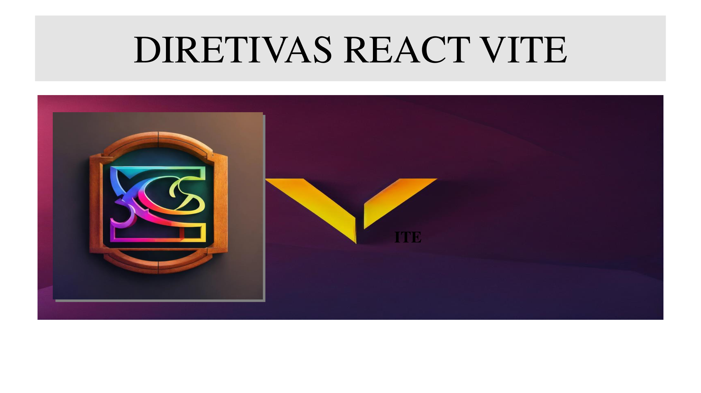

# README Mágico do Projeto React Heroico 🚀

## Bem-vindo ao Nosso Mundo!

E aí, desenvolvedor destemido! Seja bem-vindo ao projeto React Heroico, onde a magia do React se encontra com a simplicidade de um SPA.

## O que é esse Projeto?

Este projeto nasceu da necessidade de criar interfaces incríveis de forma rápida e eficiente. Usamos o React, aquele super-herói do Facebook, para tornar nossos sonhos de desenvolvimento realidade.

## Como Começar?

1. **Clone este Repositório:**
   ```bash
   git clone git@github.com:reinaldoper/prompts-for-article-generate-by-ia-chat-gpt.git


## Conheça os Superpoderes do React✨

- Diretivas Mágicas
As diretivas do React são como feitiços que guiam nosso código. Se precisamos mostrar ou esconder algo, basta dizer ao React com essas instruções especiais. Confira os exemplos nos nossos feitiços mágicos [aqui](https://vitejs.dev/guide/).

## Ciclos de Vida Heroicos🔄

Cada componente tem sua própria história em quadrinhos, desde a criação até seu último suspiro. Saiba mais sobre os ciclos de vida emocionantes [aqui](https://vitejs.dev/guide/).

## Hooks, Nossos Amigos Feiticeiros

Os hooks são como feitiços modernos para simplificar a magia. useState deixa os componentes saberem quando algo mudou, enquanto useEffect é como um assistente para tarefas após o carregamento. Conheça esses amigos [aqui](https://vitejs.dev/guide/).

## Contribuições São Bem-Vindas!

Quer fazer parte desta jornada mágica? Fique à vontade para contribuir, reportar bugs ou sugerir novos feitiços. Juntos, podemos criar algo verdadeiramente heroico!

## Hashtags Mágicas Continuam ✨

- #ReactHeroico
- #MagiaNoCodigo
- #FeiticeirosDoJS